# examine_ez-diffusion

Project examining different variables

---

The article from which the data used in this project originates.

---
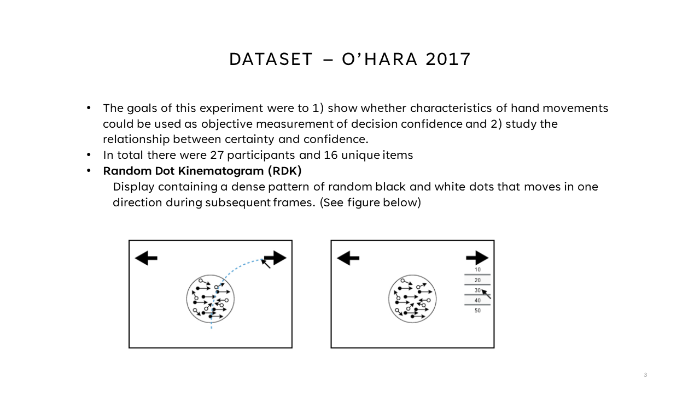

---
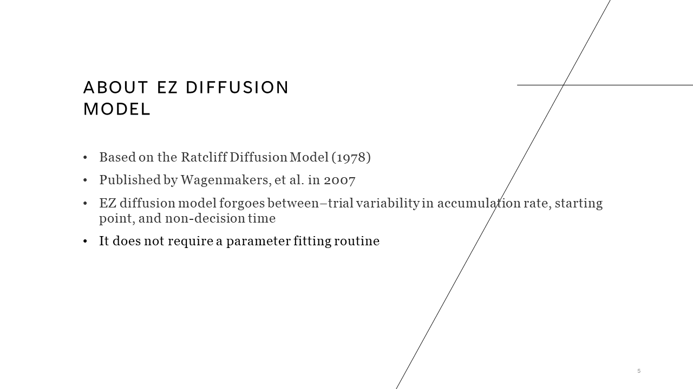

---

## Exploratory Data Analysis

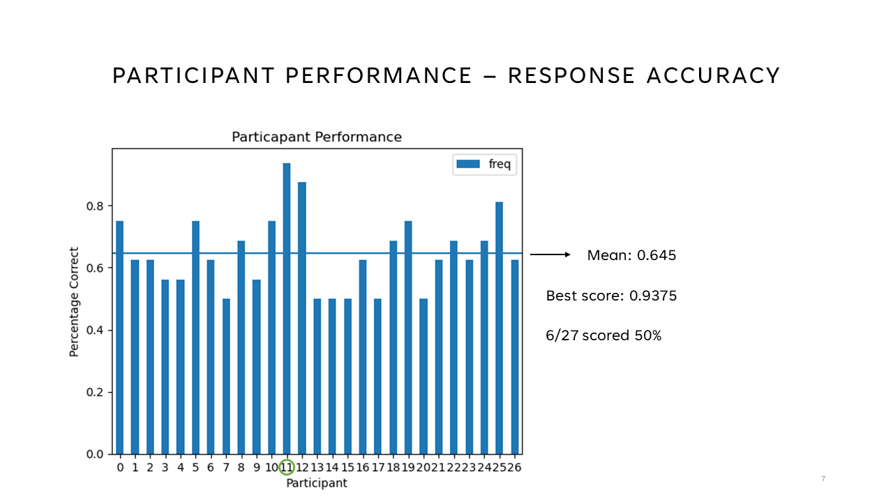

---
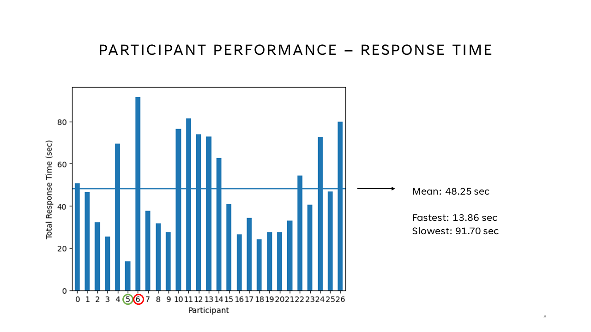

---
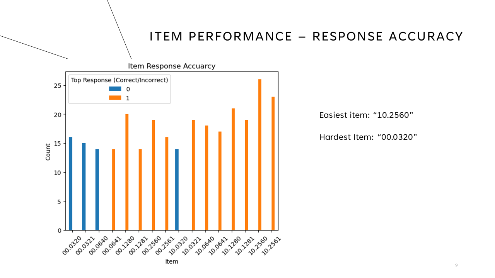

---
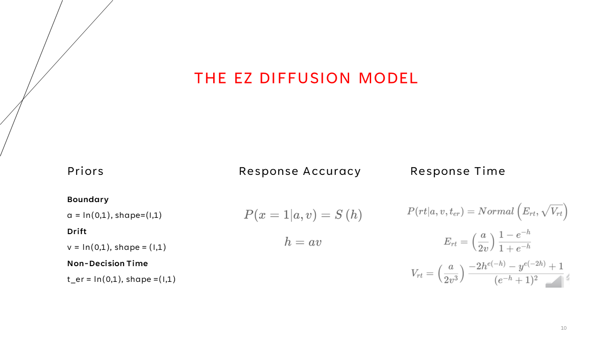

---
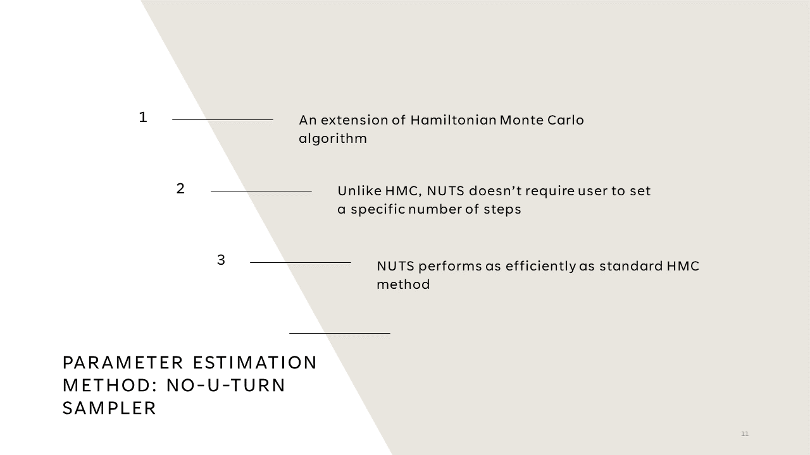

---
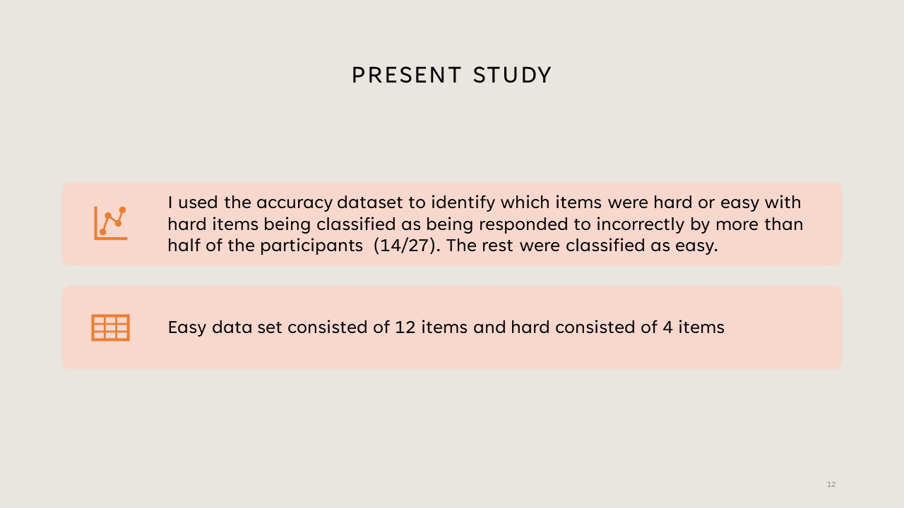

---

## Results

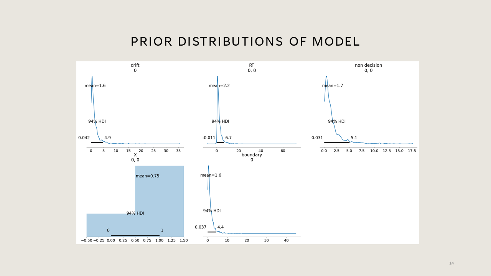

---
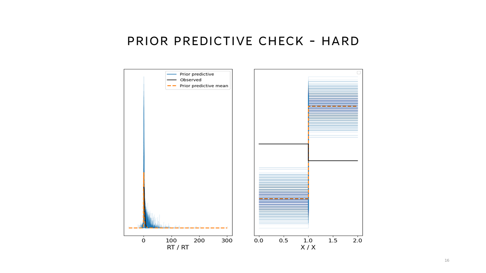

---
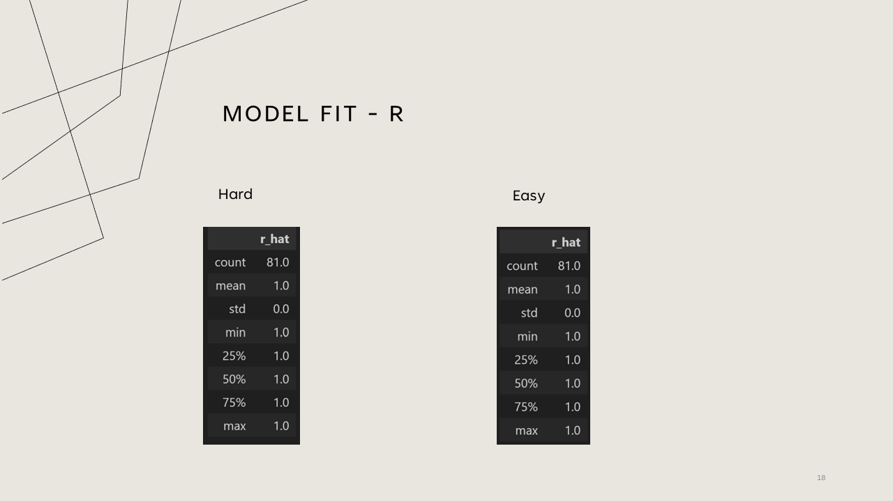

---
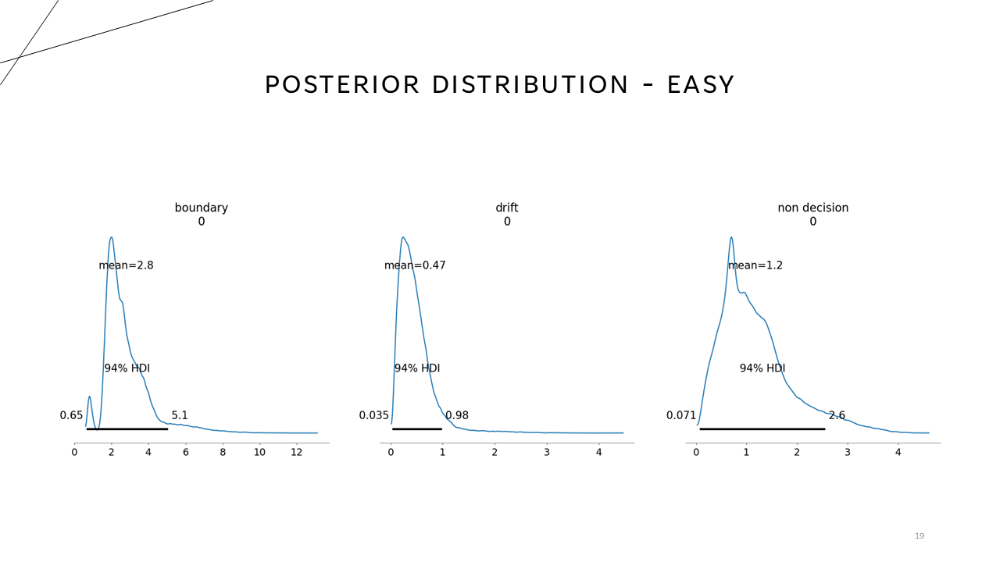

---
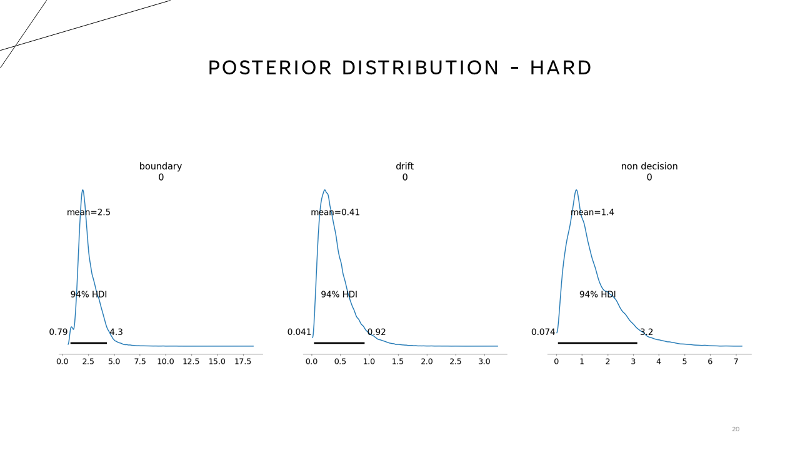

---
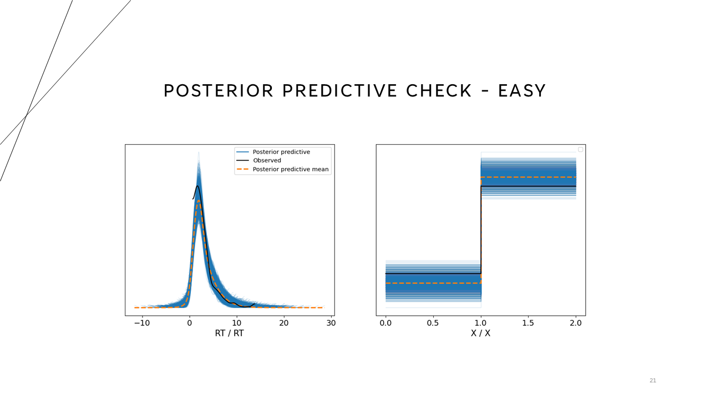

---
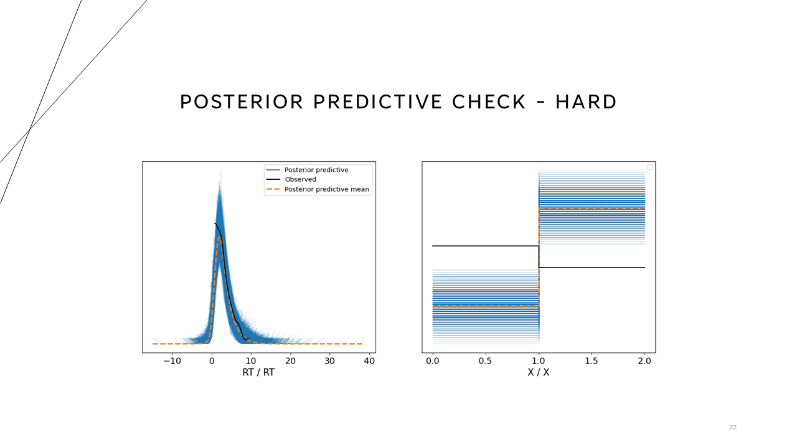

---
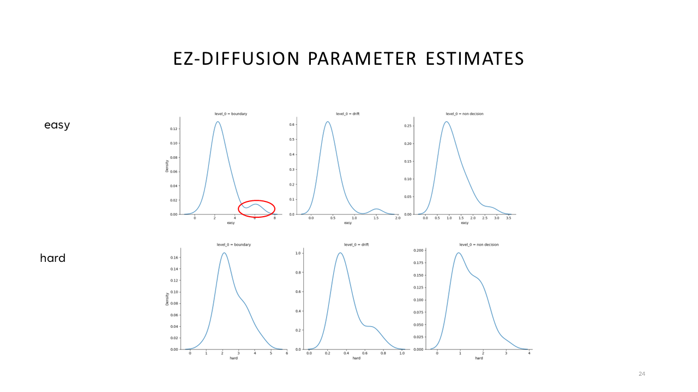

---
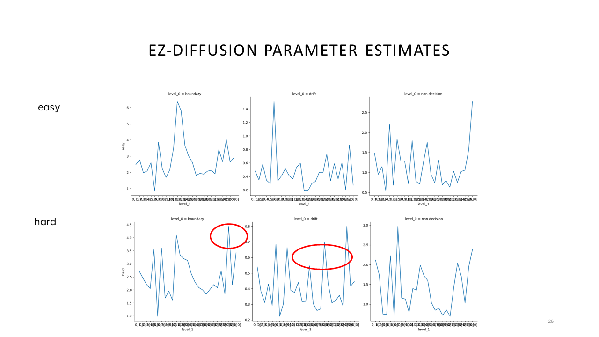

---